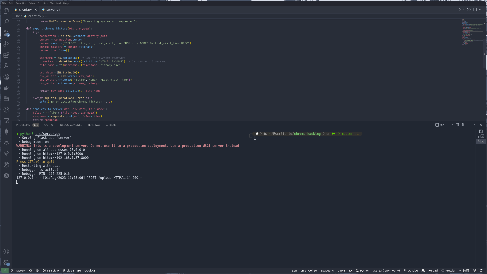

# Chrome History Uploader

Chrome History Uploader is a simple Python project that enables you to export your Chrome browsing history to a CSV file and upload it to a remote server. The project consists of two scripts: client.py and server.py.



## Disclaimer

>_This is a mock project designed for research and educational purposes only. It demonstrates a simplified example of how data can be exported and uploaded between a client and a server._

## Motivation

After finishing H4x.py project a while ago on Nate Gentile's Python course and learning about how to interact with SQLite databases, I wanted to create a simple project that demonstrates how to export data from a database and upload it to a remote server. I also wanted to learn how to use Flask to create a simple web server that listens for incoming requests. 

## Prerequisites

- Python 3.x installed on both the client and server machines.
- Flask installed on the server machine.

## Overview

### Client (client.py)

The client.py script runs on your local machine and fetches your Chrome browsing history using SQLite. It exports the history to a CSV file named chrome_history.csv. The script then sends the CSV data to the remote server using a POST request. The CSV file is given a custom name based on the current user's username and timestamp, in the format [USERNAME]_[TIMESTAMP]_history.csv.

### Server (server.py)

The server.py script runs on the remote server and listens for incoming requests on port 8000. When the server receives a POST request with the CSV data, it stores the data in a file named chrome_history_received.csv.

## Setup and Usage

### Server Setup

1. Create a virtual environment for the server:

    ```bash 
    python3 -m venv server_venv
    source server_venv/bin/activate # On Windows, use server_venv\Scripts\activate
    ```

2. Install Flask in the virtual environment:

    ```bash
    pip install Flask
    ```

3. Save the server.py script in the server.

4. Run the server:

    ```bash
    python server.py
    ```

### Using Ngrok for Remote Server (Optional)

> You can skip this if you are running the server on a remote machine with a public IP address or domain name, or if you are running the server locally and want to test the client script on the same machine.

Ngrok is a tool that allows you to expose a local server to the public internet, enabling remote access. This is useful when you want to test the mock server functionality from a remote client.

1. Download Ngrok from the official website: [https://ngrok.com/](https://ngrok.com/)

2. Unzip the downloaded file and navigate to the directory containing the ngrok executable.

3. Run the following command to expose the mock server on port 8000:

    ```bash
    ./ngrok http 8000
    ```

Ngrok will generate a public URL (e.g., https://randomstring.ngrok.io) that forwards to your mock server on port 8000.

5. Update the REMOTE_SERVER_PUBLIC_IP in client.py with the Ngrok-generated URL.

6. Now, you can run the mock client on any machine, and it will interact with the mock server via Ngrok's public URL.


### Client Setup

1. Create a virtual environment for the client:

    ```bash 
    python3 -m venv client_venv
    source client_venv/bin/activate # On Windows, use client_venv\Scripts\activate
    ```

2. Install the required packages in the virtual environment:

    ```bash
    pip install -r requirements.txt
    ```

3. Save the client.py script in the client machine.

4. Run the client:

    ```bash
    python client.py
    ```


Note: Before running the client script, make sure to update the REMOTE_SERVER_PUBLIC_IP in client.py with the public IP address or domain name of the server.

## License

This project is licensed under the MIT License. See the [LICENSE](LICENSE) file for details.

## Security Considerations

Please be aware that this is a simplified example for educational purposes. In a real-world scenario, consider adding proper authentication, access control, and encryption mechanisms to ensure the security and privacy of your data.

## Contributing

Feel free to improve and extend this project according to your needs, also feel free to reach out to me if you have any questions or suggestions. Don't forget to star the project if you found it useful and clear your browsing history regularly!
